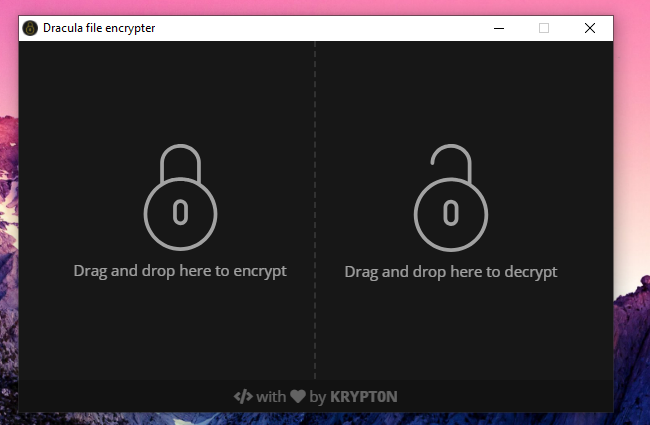
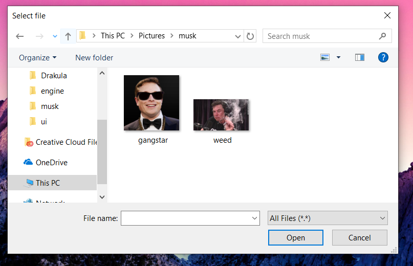
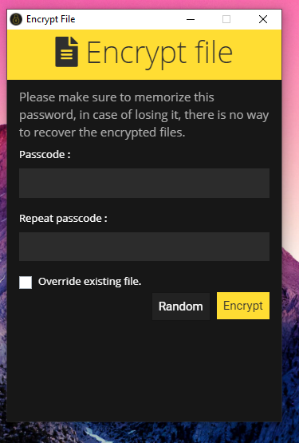
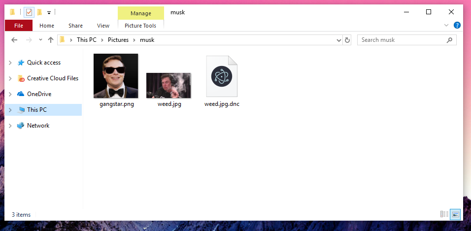

# Dracula

**Cross platform desktop application to encrypt and decrypt your files** 
*"Dance like nobody is watching, encrypt like everyone is."~Unknown*

## General informations :
Dracula is an opensource project by **KRYPT0N** (me) that consists of a crossplatform desktop application created with nodejs and electron using the web technologies, this application provides you an easy way to encrypt your files with an "encryption key" AKA **passcode**, it uses a super strong encryption algorithm known as **AES256** which is considered mathematically **impossible** to decrypt (obtain the original file) without the presence of the "encryption key". After encrypting your file, you will realize a new one has been created with a .dnc file extension (Dracula eNCrypted File). Then if you want to reaccess to your original file, you will need to decrypt this **.dnc** file using Dracula. 
Dracula also provides a built-in **gzip** compressor, so your files become lighter than before.

## How to use :
### Encrypting a file
Lets imagine that you have a secret picture of Elon Musk smoking pot! So you wish to encrypt it so only you and the key holders are able to see it. I will issume that you already installed **dracula**, first you have to fire up dracula.exe (or the desktop shortcut), then the application will show up as bellow.

The main window gives you the choice to whether you want to encrypt a file or to decrypt an encrypted file, In out scenario we will choose to encrypt by clicking of the **Encrypt** button.

A file dialog will appear as shown above, now you need to select the image to perferm the action on, then click Select.

Now a new window will popup, it indicates that you are willing to encrypt a file, it asks for a passcode AKA the encryption key and to rewrite it again to be sure that you set it right. Dracula also gives you the choice to generate a strong passcode randomly but you have to make sure you write it down on a piece of paper or to memorize it (pretty hard :3). Then submit **Encrypt**. A loading screen will appear then it will print a toast that indicates if the operation has been successfully done or an error occured.

Going back to file explorer, you will notice a new file created under the name of your orginial file concanted with a .dnc file extension.

## Horray! now you have your encrypted file that is impossible to read without your passcode!

### Decrypting a file
The decryption process is so simple, so instead of choosing "Encrypt" in the main window, just choose "Decrypt", select your file, write your passcode and you are good to go!

Coming features:
- Main window drag and drop files and folders.
- Passcode checking
- Drive encryption
- Linux and MacOs support

## Setup
### Windows
x86 : **[package.exe](https://github.com/Krypt0n36/Dracula/releases/download/1.0/package.exe)** 
x64 : **[package_x64.exe](https://github.com/Krypt0n36/Dracula/releases/download/1.0/package_x64.exe)**

